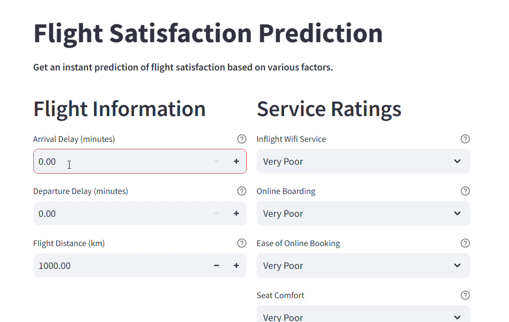

# ✈️ Airlines Customer Satisfaction Prediction - Streamlit app

A **Streamlit web application** that predicts whether a customer is *satisfied* or *neutral/dissatisfied* based on their flight experience and service feedback using a trained **LightGBM model**.

---

# Watch project demo..
[](https://youtu.be/vHVr-_B24eo)

## Features

- Predicts **customer satisfaction** using service ratings and flight details
- Uses **LightGBM** model for high accuracy
- Real-time prediction using **Streamlit UI**
- Interactive layout with input validation and explanations

---

## Getting Started

Follow these steps to run the application locally:

### 1. Clone the Repository

```bash
git clone https://github.com/sameeratanveer/crm-airline-satisfaction-prediction.git
cd airline-satisfaction-app
```
### 2. Set Up a Virtual Environment
```
python -m venv venv
source venv/bin/activate      # On Windows: venv\Scripts\activate
```

### 3. Install dependencies..
```
pip install -r requirements.txt
```

### 4.  Add Model Files
Place the following files in the project root:

lgbm_model.pkl — Trained LightGBM model

### 5. Run the application
```
streamlit run app.py
```
Open your browser and go to:
👉 http://localhost:8501

## Model Details
Model Used: LightGBM Classifier (lgbm_model.pkl)

Features Used for Prediction:

Online boarding, Inflight Wi-Fi, Cleanliness, etc.

Flight delay ratio

Travel class and type

## INPUT:
## 🧮 Input Format

| Feature                    | Type                    | Description                                      |
|----------------------------|-------------------------|--------------------------------------------------|
| Online Boarding            | Categorical (Ordinal)   | Rating from **Very Poor** to **Outstanding**     |
| Delay Ratio                | Numeric                 | Calculated as *(Total Delay / Flight Distance)*  |
| Inflight Wifi              | Categorical (Ordinal)   | Service rating                                   |
| Class                      | Categorical             | **Business**, **Eco**, or **Eco Plus**           |
| Type of Travel             | Categorical             | **Business** or **Personal**                     |
| Flight Distance            | Numeric                 | Distance in kilometers                           |
| Other Ratings (e.g., Seat Comfort, Cleanliness) | Categorical (Ordinal) | Ratings from **Very Poor** to **Outstanding**    |


